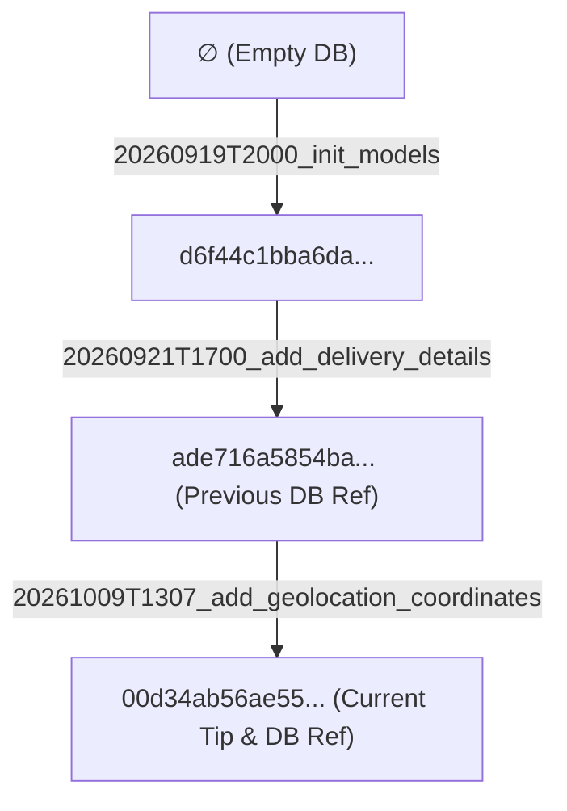

# Geolocation Persistence Migration Runbook (#9 - T1)

This runbook documents the additive schema contract, migration graph transition, constraint enforcement, and disposable recovery procedures for persisting geolocation coordinates on `Order` and `Zone` entities in accordance with Issue #9 (T1).

---

## 1. Schema Contract and Constraints

### 1.1 Fields Added
- **`Order`**:
  - `deliveryLat` (`Float?` / `float8` nullable)
  - `deliveryLng` (`Float?` / `float8` nullable)
- **`Zone`**:
  - `depotLat` (`Float?` / `float8` nullable)
  - `depotLng` (`Float?` / `float8` nullable)

### 1.2 Defaults and Backfill Policy
- **No default values**: Fields default to `NULL` at the database level.
- **No fabricated backfill**: Historical orders and zones remain identifiable with `NULL` coordinate pairs.
- **No geocoding / map interaction**: Persists only caller-supplied coordinates without external geocoding side-effects.

### 1.3 Named PostgreSQL `CHECK` Constraints
To strictly enforce coordinate integrity against incomplete pairs, out-of-range coordinates, and non-finite values (`NaN`, `Infinity`, `-Infinity`), named `@@check` constraints are defined:

- **`order_delivery_coordinates_valid`** (physical constraint: `order_delivery_coordinates_valid_84ff84b6`):
  ```sql
  ("deliveryLat" IS NULL AND "deliveryLng" IS NULL) OR
  ("deliveryLat" IS NOT NULL AND "deliveryLng" IS NOT NULL AND "deliveryLat" >= -90 AND "deliveryLat" <= 90 AND "deliveryLng" >= -180 AND "deliveryLng" <= 180)
  ```
- **`zone_depot_coordinates_valid`** (physical constraint: `zone_depot_coordinates_valid_5c13ee7e`):
  ```sql
  ("depotLat" IS NULL AND "depotLng" IS NULL) OR
  ("depotLat" IS NOT NULL AND "depotLng" IS NOT NULL AND "depotLat" >= -90 AND "depotLat" <= 90 AND "depotLng" >= -180 AND "depotLng" <= 180)
  ```

> [!NOTE]
> PostgreSQL check constraints treat `NULL` evaluation as passing unless explicitly prevented. The explicit `IS NOT NULL` guard on the second disjunct ensures that asymmetric pairs like `(4.6097, NULL)` evaluate to `FALSE` and are rejected with a `check_violation`. In PostgreSQL, standard float comparisons `val >= -90 AND val <= 90` evaluate to `FALSE` for `NaN`, `Infinity`, and `-Infinity`, safely rejecting non-finite floats.

---

## 2. Migration Graph and Ref Hierarchy

### 2.1 Graph Nodes and Edges
- **Node `∅`**: Empty database baseline.
- **Node `d6f44c1`**: Migration `20260919T2000_init_models` (27 ops).
- **Node `ade716a`**: Migration `20260921T1700_add_delivery_details` (5 ops) — previous graph tip.
- **Node `00d34ab`**: Migration `20261009T1307_add_geolocation_coordinates` (6 ops) — current graph tip.



### 2.2 Ref Checkpoint
- `migrations/app/refs/db.json`:
  ```json
  {
    "hash": "00d34ab56ae55b663a53148a126d233c0801ea6863ee0e3b22273a20d77d862e",
    "invariants": []
  }
  ```

---

## 3. Actual Prisma 8 CLI Commands

All commands use the installed Prisma 8 toolchain (`prisma@8.0.0-rc.15` / `@prisma/orm-postgres@8.0.0-rc.11`).

### 3.1 Contract Emission and Planning
1. Emit contract artifacts (`contract.json` and `contract.d.ts`):
   ```bash
   pnpm prisma contract emit
   ```
2. Plan the additive migration from the offline origin ref:
   ```bash
   pnpm prisma migration plan --name add_geolocation_coordinates
   ```
3. Advance the local checkpoint ref to the new contract hash:
   ```bash
   pnpm prisma migration ref set db 00d34ab56ae55b663a53148a126d233c0801ea6863ee0e3b22273a20d77d862e
   ```
4. Verify migration graph status:
   ```bash
   pnpm prisma migration list
   ```

### 3.2 Applying Migrations to Owned Databases
> [!CAUTION]
> Never execute migration or destructive commands on shared or development databases (`logistica_db`). Always pass an explicit, disposable database target with `--db <owned_url>`. The test harness uses an ephemeral PostgreSQL 16 container created on a random loopback port with unique UUID labels and receipts.

1. Apply pending migrations to a target owned database:
   ```bash
   pnpm prisma db migrate --db "<owned_database_url>"
   ```
2. Verify schema and contract marker alignment:
   ```bash
   pnpm prisma db verify --db "<owned_database_url>"
   ```

---

## 4. Behavior: Fresh vs. Existing / Legacy Databases and Locking

| Scenario | Migration Path | Observed Behavior & Locking Considerations |
| :--- | :--- | :--- |
| **Fresh Database** | `∅` → `d6f44c1` → `ade716a` → `00d34ab` | Applies full chain, creates all base tables, delivery details, and geolocation columns with CHECK constraints. `prisma db verify` passes with exit code 0. |
| **Existing / Legacy DB** | `ade716a` → `00d34ab` | Executes 6 additive operations (4 column additions + 2 check constraints). Historical rows remain intact with `NULL` coordinates. |

> [!WARNING]
> **Locking and Concurrency Caveat**:
> Additive `ALTER TABLE ... ADD COLUMN` and `ALTER TABLE ... ADD CONSTRAINT ... CHECK ...` operations are not lock-free in PostgreSQL. Even though nullable column additions without default values avoid table rewrites, adding constraints still acquires an `ACCESS EXCLUSIVE` lock on the relation while catalog metadata is updated and existing rows are scanned for constraint validation.
> Using `NOT VALID` avoids the table validation scan under `ACCESS EXCLUSIVE` and minimizes blocking duration, but does **NOT** completely remove all locks (PostgreSQL still briefly takes `ACCESS EXCLUSIVE` to add the constraint metadata, and subsequent `VALIDATE CONSTRAINT` acquires `SHARE UPDATE EXCLUSIVE`).
> While execution is near-instantaneous on small test fixtures, large production tables will experience lock acquisition and queue conflicting queries. Small test fixtures do not prove zero production lock duration.

---

## 5. Backup, Restore, and Disaster Recovery Procedures

Earlier diagnostic runs against fixed database names on a shared PostgreSQL instance did not prove data immutability. The verified procedure below enforces execution strictly inside programmatically managed owned fixtures with canonical containment, receipt guards, and direct process I/O.

### 5.1 Programmatic Flow in Owned Harness
Manual shell workflows with arbitrary paths or fixed `/tmp` files are strictly rejected. The supported safe flow is executed via `test/geolocation-migration.fixtures.ts`:
1. **Creation of Private Scratch Target**:
   `createScratchFile('migration-recovery')` allocates a private temporary file with exclusive creation (`flag: 'wx'`) and `0600` permissions within an owned session `mkdtemp` directory.
2. **Database Export**:
   `backupOwnedDatabase(sourceDb, scratchPath)` executes `docker exec <containerId> pg_dump` via `runExecFile` (no shell interpolation), streaming output directly into the validated registered scratch path. Unregistered paths, symlinks, or traversal attempts are rejected.
3. **Restoration into Clean Owned Target**:
   `restoreOwnedDatabase(recoveryDb, scratchPath)` reads from the registered scratch path and streams via direct child process stdin into the freshly created, registered database (`geo_restore_*`).
4. **Verification & Cleanup**:
   `runPrismaVerify(recoveryDbUrl)` verifies marker and contract alignment on the restored database. `cleanScratchFile(scratchPath)` unlinks only verified registered files.

### 5.2 Supported Verification Command
The official, automated verification command that runs this entire flow in an isolated ephemeral PostgreSQL container is:
```bash
pnpm run test:e2e --runInBand --testPathPatterns=geolocation-migration.e2e-spec.ts
```

> [!NOTE]
> **Recovery and Invariance Retained**:
> Recovery is tested against fresh disposable targets only, never touching shared databases. The fact that the normalized SHA256 checksum of the shared development database (`logistica_db`) matched before and after the new harness run proves that the persistent state remained unchanged between the start and end of this run; it does not serve as retrospective proof that no transient writes occurred during earlier, pre-repair runs.

---

## 6. Verification and Automated Test Coverage

The test suite in [`test/geolocation-migration.e2e-spec.ts`](../test/geolocation-migration.e2e-spec.ts) and unit harness in [`test/geolocation-migration.fixtures.spec.ts`](../test/geolocation-migration.fixtures.spec.ts) provide automated verification:
- **Owned Container Isolation**: Spins up an ephemeral `postgres:16-alpine` container on a random `127.0.0.1` port with a validated UUID session token label and full 64-hex container ID verification. Rejects external `DATABASE_URL` entries and shared service targets. Refuses deletion of unowned or foreign containers.
- **Boundary & Scratch Containment**: Rejects foreign paths, path traversal, malicious prefixes, and symlinks in scratch file creation, backup, restore, and cleanup operations.
- **Receipt Immutability**: Guarantees session receipts returned to callers are frozen and immutable, preventing external state tampering.
- **RED on baseline**: Verifies baseline hash `ade716a` lacks `deliveryLat`, `deliveryLng`, `depotLat`, and `depotLng`.
- **Legacy migration**: Validates migration over populated historical records (`user`, `driver`, `zone`, `route`, `product`, `order`, `orderItem`), confirming coordinate fields are actually `NULL` (`o-legacy-1|Calle 100 #15-20|true|true|50`) and route/foreign key relationships remain intact.
- **Fresh migration**: Validates complete migration from scratch with `prisma db verify`.
- **Constraint tests**:
  - Accepts `(NULL, NULL)` pairs on Order and Zone.
  - Accepts valid finite pairs in range (`[-90, 90]`, `[-180, 180]`).
  - Rejects incomplete pairs (`(val, NULL)` and `(NULL, val)`).
  - Rejects out-of-range coordinates (`> 90`, `< -90`, `> 180`, `< -180`).
  - Rejects `NaN`, `Infinity`, and `-Infinity`.
- **Backup & restore**: Validates dump/restore roundtrip into a fresh disposable target with zero data loss, relation preservation, and active check constraint enforcement.
- **Observed Cleanup and Teardown Limits**: Tests verify that under normal test completion and handled termination signals (SIGINT, SIGTERM, SIGHUP), all registered owned containers, databases, and scratch files are cleaned up. However, uncatchable termination (`SIGKILL / kill -9`) or Docker daemon failure cannot be guaranteed to achieve zero leftovers without an external sweeper.
